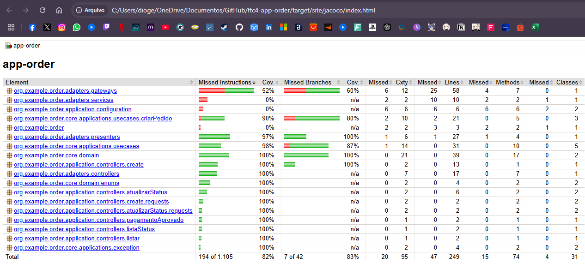

## Integração com o Serviço de Pagamento

Quando um pedido é criado, o sistema realiza automaticamente uma chamada via API para o serviço de pagamento, passando os seguintes parâmetros:

- `uuid` do pedido
- Informações do `cliente`
- `valor` do pedido

### Configuração

Para que a integração funcione corretamente, é necessário adicionar a variável `URL_API_PAYMENT` no arquivo `.env` com a URL do serviço de pagamento.

### Alteração para Fila

Se for necessário modificar a chamada via API para uma fila de processamento, basta atualizar a implementação da classe:

```java
public class RequestService implements RequestInterface
```

# Testes
* Para rodar os testes, execute o comando `mvn test` na raiz do projeto.

Cobertura de testes:
